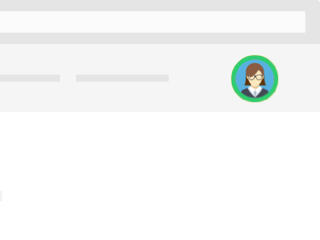

# Frontend Coding Challenge

Here is a quick coding challenge. It's important to note that it's by no means a pixel perfect test with a single correct answer, we just want to get a sense for how you write code and approach solving problems.

You'll be building a simple component: an agent status picker. The mocked up UX looks like this:

The user clicks their avatar to open a popover providing the ability to change their status from the list. After selecting the desired status a (fake) HTTP request is made while a loading spinner runs, the popover closes and an updated avatar indicating the status will appear in the initial view.

### Colours

Whatever looks good! :-)

For reference the following colours are used in the mockup above:

* Available indicator: `rgb(46, 204, 113)`
* Not Ready indicator: `rgb(251, 197. 49)`
* Unavailable indicator: `rgb(194, 54, 22)`
* Popover: `rgb(53, 59, 72)`
* Loading spinner grey: `rgb(220, 221, 225)`
* Loading spinner blue: `rgb(132, 227, 100)`

### Instructions

* We prefer React and Redux using Typescript ourselves, but please choose the framework you are most comfortable with to approach the challenge 
* You can assume and mock the APIs and the data structure returning the avatar and the current status in the first place
* The call to update the status should be faked as well, add a 1 second delay when simulating it
* The number of statuses is fixed as per the order "Available, Not Ready, Unavailable" and should always be ranked in that order
* You may split up the main component in as many sub-components as you see fit
* Think of it as a component that will end up in a larger, scalable application (consider this when writing the HTML and CSS as well!)
* You're free to use as many third party JS libraries that you see fit
* You're free to use any build tools that you like (including CSS pre/post-processors). Do not focus too much on the tooling though. Choose tools that get you going quickly.

### Do I need to write tests?

As mentioned we just want to get a sense for how you write code and solve problems, so treat this as any other piece of production code you deliver using the test toolchain of your choice.

### Submitting your challenge

* The challenge has to be shared as a git repository
* You can either create a public repository on your favourite git hosting provider (GitHub, GitLab, BitBucket) and share the link
* Or send the whole repository, zipped (including the .git directory!)
* Please include both build and run instructions, we use a mix of Windows and Mac on our end
* Important note, please only submit your challenge when you feel you are completely done!
